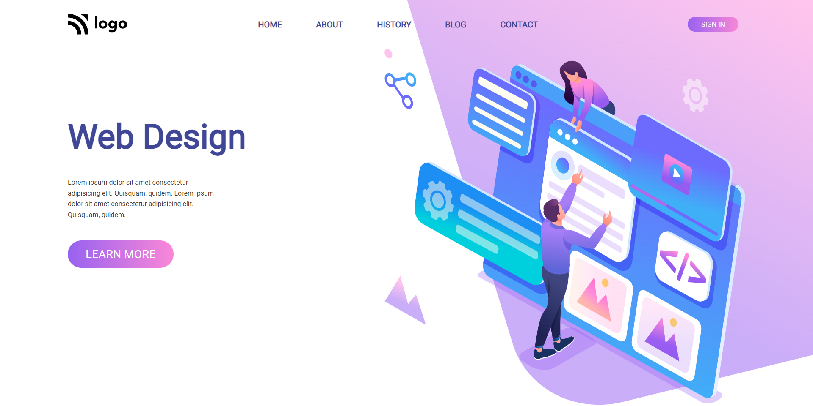

# HTML  and CSS 

# Project 8 - Web Design Landing Page 

By Maulik Vadodariya

## [Link to the live Project](https://web-design-landing-web.netlify.app/)

## What I learned from this Project?

- I have done this project using `HTML` and `CSS` only.
- Responsive web design.

## I spent 3 to 4 hours in making this project
